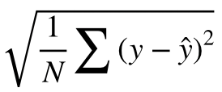

<h1>kaggle korea에서 진행한 데이터 사이언스 대회 (<a href="http://bitly.kr/5vlMjB">링크</a>)</h1>
데이터를 분석하여 집값 예측하기  
<h2>분석 및 예측 목적</h2>
데이터를 분석하여 어떤 조건을 가진 집의 가격이 높고 낮은지를 예측하는 모델을 만드는 것 
train.csv의 price를 활용하여 지도학습 후 test.csv의 price을 예측  
<h2>평가방식</h2>
RMSE (Root Mean Squared Error) 
  
  
  
  
<h2>Data</h2>
train.csv : 예측 모델을 만들기 위해 사용하는 학습 데이터 
test.csv : 예측할 price 변수를 제외한 집의 정보가 담긴 테스트 데이터(예측 데이터) 
sample_submission.csv : 제출 예시 파일  
  
Data fields : https://www.notion.so/Data-69d53e6a999e4efba81f0f2c72d79407
